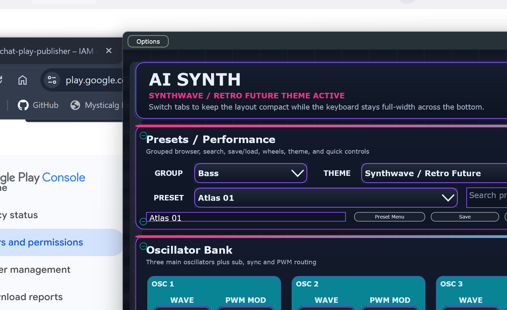

# AI Synth (VSTi)

A JUCE-based synthesizer project designed to run in Cubase and other plugin hosts.

By default this project builds **VST3 + Standalone**. Optional legacy **VST2 (.dll)** output can be enabled for personal/local builds (for older hosts like Cubase 5) when you provide a local VST2 SDK path.

Live page + downloads: [mysticalg.github.io/AI-Synth](https://mysticalg.github.io/AI-Synth/)

Support development: [buymeacoffee.com/dhooksterm](https://buymeacoffee.com/dhooksterm)



## Features
- Oscillators: sine, saw, square, noise
- FM oscillator (ratio, amount, mix)
- ADSR with curve control and stepped mode
- Envelope visualization in plugin UI
- Modulation routing controls (LFO->filter, ENV->filter)
- Unison up to 128 voices with stereo pan + Hz spread
- Filter + built-in FX: delay, phaser, flanger, distortion/overdrive
- GitHub Actions builds packaged VST3 + Standalone artifacts (macOS/Windows/Linux)
- GitHub Pages site deployed automatically from `docs/`
- Optional local VST2 build mode for legacy hosts (e.g. Cubase 5)

## Build locally
```bash
cmake -S . -B build -DCMAKE_BUILD_TYPE=Release
cmake --build build --config Release --target AISynth_VST3
```

The generated `.vst3` bundle will appear in the `build` tree in the platform-specific plugin output folder.

### Build the standalone app locally
```powershell
.\build-local.ps1
```

This uses `cmake` from `PATH` when available, or the bundled copy from Visual Studio 2022 Build Tools.

The standalone executable is written to:
```text
build\AISynth_artefacts\Release\Standalone\AI Synth.exe
```

To build both outputs in one go:
```powershell
.\build-local.ps1 -Target All
```

### Build on GitHub Actions
- Pushes/PRs automatically build packaged **VST3 + Standalone** artifacts on Linux, Windows, and macOS.
- Pushes to `main` or `master` also publish a rolling prerelease with stable download URLs for the GitHub Pages site.
- Legacy **VST2 (Windows)** can be built from **Actions -> Build Plugins -> Run workflow** by enabling `build_vst2_windows`.
- For the VST2 workflow, add a repository secret named `VST2_SDK_ZIP_BASE64` containing a base64-encoded zip of your local VST2 SDK folder (not distributed by this repo).

### Publish GitHub Pages automatically
- Pushes to `main` or `master` also deploy the `docs/` site via the **Deploy GitHub Pages** workflow.
- The published page is available at [mysticalg.github.io/AI-Synth](https://mysticalg.github.io/AI-Synth/).
- The published page uses the screenshots in `docs/assets/` and links directly to the latest downloadable builds.

You can generate the secret value locally (PowerShell):
```powershell
$bytes = [IO.File]::ReadAllBytes("C:\path\to\vst2_sdk.zip")
[Convert]::ToBase64String($bytes) | Set-Clipboard
```
Then paste the clipboard value into the GitHub repository secret `VST2_SDK_ZIP_BASE64`.


## Optional: Build a VST2 `.dll` for Cubase 5
> This requires a locally installed VST2 SDK path. This repository does **not** include or distribute the SDK.

On Windows PowerShell:
```powershell
$env:VST2_SDK_DIR = "C:\path\to\vst2_sdk"
cmake -S . -B build-vst2 -DAISYNTH_ENABLE_VST2=ON -DCMAKE_BUILD_TYPE=Release
cmake --build build-vst2 --config Release --target AISynth_VST
```

If `VST2_SDK_DIR` is missing, CMake will warn and continue building VST3/Standalone only.
